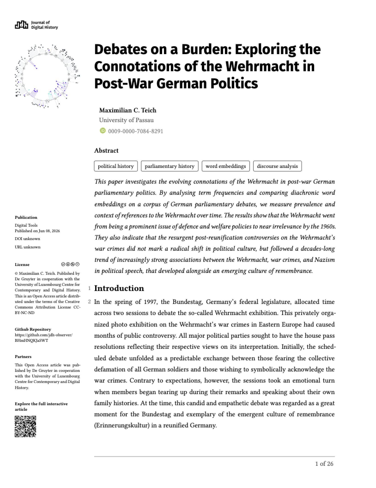

# Journal of Digital History

A typst template for Journal of Digital History Articles using MyST Markdown.



## Usage

The template is used by [jdh-cli](https://github.com/curvenote/jdh-cli) for PDF export. An article's `meta-jdh.yml` points at it:

```yaml
exports:
  - format: pdf
    template: ../../jdh-typst-template
    article: article.md
    output: article.pdf
    qr_code: ./generated/qr.png
    fingerprint: ./generated/fingerprint.png
```

`jdh-cli build` then runs `myst build --pdf` in the article's `_improved/` workdir, so this repo is expected at `../../jdh-typst-template` relative to that folder (or pass `--template`).

## Options and frontmatter

| Option | Type | Purpose |
| --- | --- | --- |
| `qr_code` | file | QR code image shown in the sidebar |
| `fingerprint` | file | Fingerprint image shown in the sidebar |

Required frontmatter: `title`, `authors`. Also read when present: `subtitle`, `short_title`, `open_access`, `keywords`, `date`, `doi`, `venue`, `license`, `github`, `first_page`, and the `abstract` part. See `template.yml`.

The sidebar's publication block shows the issue (`venue`), the publication date (`date`, or "Forthcoming" when the `forthcoming` option is set), the DOI and the article URL (`article_url` option). The licence badge and text follow `license`, with CC BY-NC-ND as the fallback. jdh-cli sets all of these from the JDH API.

## JDH theme

`jdh.typ` holds the layout and a `jdh-theme` dictionary of tunable tokens:

| Token | Controls |
| --- | --- |
| `code` | Monospace code: font, size, truncation (`max-lines`, `fade-lines`) |
| `heading`, `paragraph-number` | Heading styles and margin paragraph numbers |
| `hermeneutics` | Cyan full-width blocks (`#hermeneutics-block`) |
| `narrative-code` | Gray full-width code blocks (`#narrative-code-block`) |
| `table` | JDH tables (`#jdh-table-enter` / `#jdh-table-leave`): zebra striping, row and column limits |

The blocks are emitted by jdh-cli's MyST plugins as raw Typst.

### Figure placement

Figures stay where they are in the text by default (`placement: none`), so the PDF reads in notebook order, like the online article. The `figure_placement` export option (`jdh-cli build --figure-placement auto`) floats them to the top or bottom of a page instead. Tables and dialogue always stay in the text flow.

### Citations

APA 7th, JDH's house style: "(Hellman, 2001)" in the text and an alphabetical reference list. It's set in two places, and the first wins: the `#bibliography(…, style: "apa")` call in `template.typ`, and `set bibliography(…)` in `jdh.typ`. Change both to switch style.

### Paragraph numbers

Paragraphs are numbered in the left margin. Two modes:

- **Cell numbers (JDH articles):** jdh-cli puts `#jdh-cell(n)` before each markdown cell, with the number the JDH website gives that cell. The next paragraph, heading, block quote or list shows `n`; the rest of the cell shows no number. Code cells show none, so the numbers have gaps, as on the website.
- **Running count:** without any `#jdh-cell` markers, every paragraph and heading takes the next number.

Front matter uses the published [pubmatter](https://github.com/continuous-foundation/pubmatter) package (`@preview/pubmatter:0.2.2`). The JDH title block (title font and size from the theme, boxed author cards with affiliations and ORCID) is in `jdh-frontmatter.typ`, built on pubmatter's public functions.

## Fonts

Bundled under `fonts/` and listed in `font-paths.txt`:

- **Libertinus Serif** – body text, footer, sidebar (`theme.font`)
- **Fira Sans** – main article title (`theme.title-font`)
- **Fira Code** – code blocks (`theme.code.font`)

`jdh-cli build` sets `TYPST_FONT_PATHS` to `fonts/fira_code` only; Libertinus Serif and Fira Sans are resolved from system fonts unless installed. To compile with all bundled fonts directly with Typst:

```bash
typst compile \
  --font-path fonts/libertinus_serif \
  --font-path fonts/fira_sans \
  --font-path fonts/fira_code \
  article.typ article.pdf
```
